@[tweet](https://twitter.com/jack/status/20)

https://twitter.com/jack/status/20

## Gists

@[gist](https://gist.github.com/hofmannsven/9164408)

https://gist.github.com/mattpodwysocki/218388

### specific file

@[gist](https://gist.github.com/hofmannsven/9164408?file=my.cnf)

ssfafafaffafa


## mermaid.js

```mermaid
%%{init: { 'theme': 'forest' } }%%
graph LR;
    A-->B & C-->D & E-->F & Z-->X;
    F-->G
    G-->H
    H-->I
    I-->J
    J-->K
    K-->L
    L-->M
    M-->N
    N-->O
    O-->P
    P-->ID1[ノード1<br>ノード2]
```



### flowchart


### sequence diagram

```mermaid
sequenceDiagram
    autonumber
    アリス->>光輝: Hello John, how are you?
    loop Healthcheck
        光輝->>光輝: Fight against hypochondria
    end
    Note right of 光輝: Rational thoughts!
    光輝-->>アリス: Great!
    光輝->>Bob: How about you?
    Bob-->>光輝: Jolly good!
```



### class diagram

```mermaid
 classDiagram
      Animal <|-- Duck
      Animal <|-- Fish
      Animal <|-- Zebra
      Animal : +int age
      Animal : +String gender
      Animal: +isMammal()
      Animal: +mate()
      class Duck{
          +String beakColor
          +swim()
          +quack()
      }
      class Fish{
          -int sizeInFeet
          -canEat()
      }
      class Zebra{
          +bool is_wild
          +run()
      }
      callback Duck callback "Tooltip"
```


### state diagram


```mermaid
graph LR
A:::someclass  B
classDef someclass fill:#f96;
classDef someclass fill:#f96;
classDef someclass fill:#f96;
classDef someclass fill:#f96;
classDef someclass fill:#f96;
classDef someclass fill:#f96;
classDef someclass fill:#f96;
classDef someclass fill:#f96;
classDef someclass fill:#f96;
classDef someclass fill:#f96;
classDef someclass fill:#f96;
classDef someclass fill:#f96;
classDef someclass fill:#f96;
classDef someclass fill:#f96;
classDef someclass fill:#f96;
classDef someclass fill:#f96;
classDef someclass fill:#f96;
classDef someclass fill:#f96;
classDef someclass fill:#f96;
classDef someclass fill:#f96;
classDef someclass fill:#f96;
classDef someclass fill:#f96;
classDef someclass fill:#f96;
classDef someclass fill:#f96;
classDef someclass fill:#f96;
classDef someclass fill:#f96;
    A-->B & C-->D & E-->F & Z-->X;
    A-->B & C-->D & E-->F & Z-->X;
    A-->B & C-->D & E-->F & Z-->X;
    A-->B & C-->D & E-->F & Z-->X;
    A-->B & C-->D & E-->F & Z-->X;
    A-->B & C-->D & E-->F & Z-->X;
    A-->B & C-->D & E-->F & Z-->X;
    A-->B & C-->D & E-->F & Z-->X;
    A-->B & C-->D & E-->F & Z-->X;
    A-->B & C-->D & E-->F & Z-->X;
    A-->B & C-->D & E-->F & Z-->X;
    A-->B & C-->D & E-->F & Z-->X;
    A-->B & C-->D & E-->F & Z-->X;
    A-->B & C-->D & E-->F & Z-->X;
    A-->B & C-->D & E-->F & Z-->X;
    A-->B & C-->D & E-->F & Z-->X;
    A-->B & C-->D & E-->F & Z-->X;
    A-->B & C-->D & E-->F & Z-->X;
    A-->B & C-->D & E-->F & Z-->X;
    A-->B & C-->D & E-->F & Z-->X;
    A-->B & C-->D & E-->F & Z-->X;
    A-->B & C-->D & E-->F & Z-->X;
    A-->B & C-->D & E-->F & Z-->X;
    A-->B & C-->D & E-->F & Z-->X;
    A-->B & C-->D & E-->F & Z-->X;
    A-->B & C-->D & E-->F & Z-->X;
    A-->B & C-->D & E-->F & Z-->X;
    A-->B & C-->D & E-->F & Z-->X;
    A-->B & C-->D & E-->F & Z-->X;
    A-->B & C-->D & E-->F & Z-->X;
    A-->B & C-->D & E-->F & Z-->X;
    A-->B & C-->D & E-->F & Z-->X;
    A-->B & C-->D & E-->F & Z-->X;
    A-->B & C-->D & E-->F & Z-->X;
    A-->B & C-->D & E-->F & Z-->X;
```


```mermaid
graph LR;
    alert`md5_salt`-->B;
    click alert`md5_salt` eval "Tooltip for a callback"
    click B "javascript:alert('XSS')" "This is a tooltip for a link"
    link Zebra "http://www.github.com" "This is a link"
```
