https://twitter.com/jack/status/20
https://twitter.com/jack/status/20
https://twitter.com/jack/status/20

https://twitter.com/jack/status/20
https://twitter.com/jack/status/20

https://twitter.com/jack/status/20


*captions*

dfasdfa
dfa
fd
a
fafdafdafda
```bash
console.log({
  a: "a",
  b: "b",
  c: {
    d: "d"
  }
})
```


aafaffff


``` js:fooBar.js
var foo = function (bar) {
  return bar++;
};

console.log(foo(5));
// 👇can scroll horizontally
console.log(aaaaaaaaaaaaaaaaaaaaaaaaaaaaaaaaaaaaaaaaaaaaaaaaaaaaaaaaaaaaaaaaaaaaaaaaaaaaaaaaaaaaaaaaaaaaaaaaaaaaaaaaaaaaaaaaaaaaaaaaaaaaaaaaaaaaaaaaaaaaaaaaaaaaaaaaaaaaaaaaaaaaaaaaaaaaaaaaaaaaaaaaaaaaa);
```

```js diff :fooBar.js
@@ -4,6 +4,5 @@
-    let foo = bar.baz([1, 2, 3]);
-    foo = foo + 1;
+    const foo = bar.baz([1, 2, 3]) + 1;
     console.log(`foo: ${foo}`);
```

``` js:example
var foo = function (bar) {
  return bar++;
};
```

``` html:<should escape>
var foo = function (bar) {
  return bar++;
};
```

```Dockerfile
FROM ubuntu
ENV name value # comment
ENV name=value
CMD ["echo", "$name"]
```

```html
<div>a</div>
```


::: message
here be dragons
:::


::: message alert
here be dragons
:::


↓ escaped


```">
aaa
```


[this $ should be escaped](https://docs.angularjs.org/api/ng/service/$http#json-vulnerability-protection)
[this $$ should be escaped](https://docs.angularjs.org/api/ng/service/$$http#json-vulnerability-protection)

[test on markdown-it-textmath](https://goessner.github.io/markdown-it-texmath/index.html)

$a$	

$a\ne0$

$\varphi$

$1+1=2$	

$1+1<3$	

$a \backslash$	

You get 3$ if you solve $1+2$	

If you solve $1+2$ you get $3	

$\frac{1}{2}$	

$\begin{pmatrix}x\\y\end{pmatrix}$	

${\tilde\bold e}_\alpha$	

$a^{b}$	

$a^*b$ with $a^*$	

$\sum_{i=1}^n$	
fafa

a


## mermaid.js

```mermaid
%%{init: { 'theme': 'forest' } }%%
graph LR;
    A-->B & C-->D & E-->F & Z-->X;
    F-->G
    G-->H
    H-->I
    I-->J
    J-->K
    K-->L
    L-->M
    M-->N
    N-->O
    O-->P
    P-->ID1[ノード1<br>ノード2]
```



### flowchart


### sequence diagram

```mermaid
sequenceDiagram
    autonumber
    アリス->>光輝: Hello John, how are you?
    loop Healthcheck
        光輝->>光輝: Fight against hypochondria
    end
    Note right of 光輝: Rational thoughts!
    光輝-->>アリス: Great!
    光輝->>Bob: How about you?
    Bob-->>光輝: Jolly good!
```



### class diagram


### state diagram


```mermaid
graph LR
A:::someclass  B
classDef someclass fill:#f96;
classDef someclass fill:#f96;
classDef someclass fill:#f96;
classDef someclass fill:#f96;
classDef someclass fill:#f96;
classDef someclass fill:#f96;
classDef someclass fill:#f96;
classDef someclass fill:#f96;
classDef someclass fill:#f96;
classDef someclass fill:#f96;
classDef someclass fill:#f96;
classDef someclass fill:#f96;
classDef someclass fill:#f96;
classDef someclass fill:#f96;
classDef someclass fill:#f96;
classDef someclass fill:#f96;
classDef someclass fill:#f96;
classDef someclass fill:#f96;
classDef someclass fill:#f96;
classDef someclass fill:#f96;
classDef someclass fill:#f96;
classDef someclass fill:#f96;
classDef someclass fill:#f96;
classDef someclass fill:#f96;
classDef someclass fill:#f96;
classDef someclass fill:#f96;
    A-->B & C-->D & E-->F & Z-->X;
    A-->B & C-->D & E-->F & Z-->X;
    A-->B & C-->D & E-->F & Z-->X;
    A-->B & C-->D & E-->F & Z-->X;
    A-->B & C-->D & E-->F & Z-->X;
    A-->B & C-->D & E-->F & Z-->X;
    A-->B & C-->D & E-->F & Z-->X;
    A-->B & C-->D & E-->F & Z-->X;
    A-->B & C-->D & E-->F & Z-->X;
    A-->B & C-->D & E-->F & Z-->X;
    A-->B & C-->D & E-->F & Z-->X;
    A-->B & C-->D & E-->F & Z-->X;
    A-->B & C-->D & E-->F & Z-->X;
    A-->B & C-->D & E-->F & Z-->X;
    A-->B & C-->D & E-->F & Z-->X;
    A-->B & C-->D & E-->F & Z-->X;
    A-->B & C-->D & E-->F & Z-->X;
    A-->B & C-->D & E-->F & Z-->X;
    A-->B & C-->D & E-->F & Z-->X;
    A-->B & C-->D & E-->F & Z-->X;
    A-->B & C-->D & E-->F & Z-->X;
    A-->B & C-->D & E-->F & Z-->X;
    A-->B & C-->D & E-->F & Z-->X;
    A-->B & C-->D & E-->F & Z-->X;
    A-->B & C-->D & E-->F & Z-->X;
    A-->B & C-->D & E-->F & Z-->X;
    A-->B & C-->D & E-->F & Z-->X;
    A-->B & C-->D & E-->F & Z-->X;
    A-->B & C-->D & E-->F & Z-->X;
    A-->B & C-->D & E-->F & Z-->X;
    A-->B & C-->D & E-->F & Z-->X;
    A-->B & C-->D & E-->F & Z-->X;
    A-->B & C-->D & E-->F & Z-->X;
    A-->B & C-->D & E-->F & Z-->X;
    A-->B & C-->D & E-->F & Z-->X;
```


```mermaid
graph LR;
    alert`md5_salt`-->B;
    click alert`md5_salt` eval "Tooltip for a callback"
    click B "javascript:alert('XSS')" "This is a tooltip for a link"
    link Zebra "http://www.github.com" "This is a link"
```
