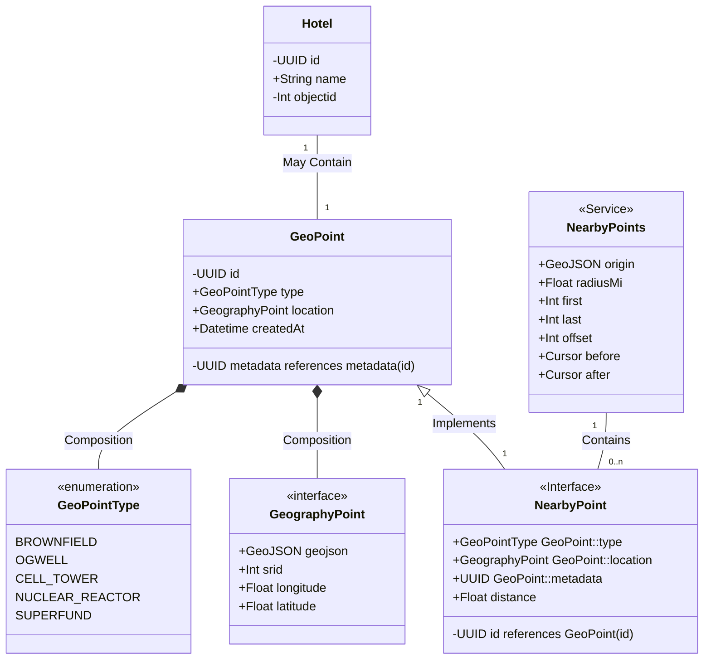

`<iframe />` を用いて要素を表示する機能の一覧

## Github

**短い行数**

https://github.com/zenn-dev/zenn-editor/blob/canary/lerna.json

**長い行数**

https://github.com/zenn-dev/zenn-editor/blob/canary/yarn.lock

**行数指定**

https://github.com/zenn-dev/zenn-editor/blob/canary/yarn.lock#L4-L14

**開始行のみ指定**

https://github.com/zenn-dev/zenn-editor/blob/canary/yarn.lock#L4

## Github Gist

@[gist](https://gist.github.com/octocat/6cad326836d38bd3a7ae)

## Link Card ( Default )

https://zenn.dev

## Link Card ( Github Repository )

https://github.com/zenn-dev/zenn-editor

## Link Card ( Github Repository 以外のページ )

https://github.com/zenn-dev/zenn-editor/issues

## Mermaid

## Tweet Card

https://twitter.com/jack/status/20
